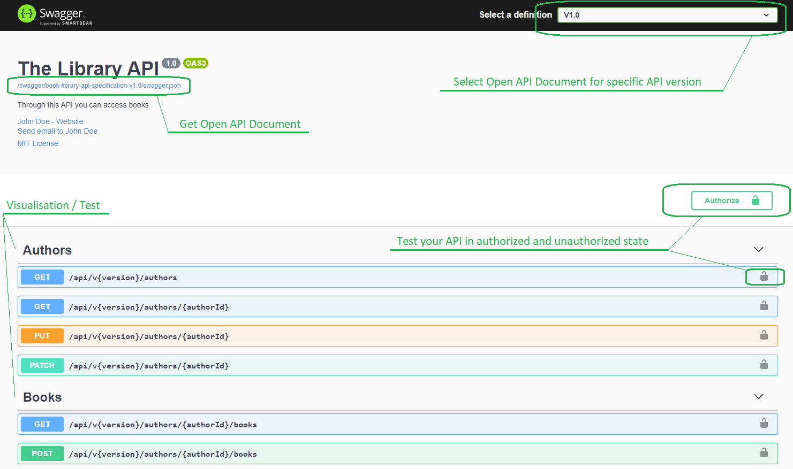

# swashbuckle-example
## Intro
This is an example of creating an open API (Swagger) documentation/specification using Swashbuckle.

### Used Software Building Blocks
* Dependency Inversion
* Logging
* EF Core
* EF Core - In Memory
* Repositories
* Basic Authentication
* Automapper
* Open API Documentation
* Web API Versioning

### The Project

This is an ASP NET Core 3.1 application.

The address to get the **UI** (is set as default):<br>
https://localhost:44396/index.html

Click on the link in the **UI** to get the open API specification.<br>
For authorisation scenario the user is *user* and password is *password*.<br>
<br>


<p align="center"><i>The <b>UI</b></i></p>

## Comments to Creation of the Open API Specification
### Xml-Documentation
In order to activate the documentation of the API you have to activate the xml-comments in the project.<br>
Next add the code to the `ConfigureServices`-method in Startup-class:

```csharp
    services.AddSwaggerGen(setupAction =>
    {
        setupAction.SwaggerDoc(OPEN_API_SPECIFICATION_NAME,
            new Microsoft.OpenApi.Models.OpenApiInfo()
            {
                Title = "Library API",
                Version = "1"
            });

        var xmlCommentsFile = $"{Assembly.GetExecutingAssembly().GetName().Name}.xml";
        var xmlCommentsFullPath = Path.Combine(AppContext.BaseDirectory, xmlCommentsFile);
        setupAction.IncludeXmlComments(xmlCommentsFullPath);
    });
```

In order to get return value comments you have to add xml-comments to the DTO-types, which will be returned.

### Data Annotations

You can add data annotations in order to extend the documentation i.e. of DTOs (data transfer objects):
```csharp
    [Required]
    [MaxLength(150)]
    public string Summary { get; set; }
```

### Description of possible responses

Add attributes and comments to extend the generated open API specification by possible responses:

```csharp
        /// <summary>
        /// Get a book by id for a specific author.
        /// </summary>
        /// <param name="authorId">The id of the book author.</param>
        /// <param name="bookId">The id of the book.</param>
        /// <returns>An ActionResult of type Book.</returns>
        /// <response code="200">Returns the requested book.</response>
        [ProducesResponseType(StatusCodes.Status404NotFound)]
        [ProducesResponseType(StatusCodes.Status400BadRequest)]
        [ProducesResponseType(StatusCodes.Status200OK)]
        [HttpGet("{bookId}")]
        public async Task<ActionResult<Book>> GetBook(
    ...
```

If you know, that every method in your controller produces a specific response, you can add the information at controller level:

```csharp
    [Route("api/authors/{authorId}/books")]
    [ApiController]
    [ProducesResponseType(StatusCodes.Status400BadRequest)]
    [ProducesResponseType(StatusCodes.Status406NotAcceptable)]
    [ProducesResponseType(StatusCodes.Status500InternalServerError)]
    public class BooksController : ControllerBase
    {
        ...
```

If the response types apply even for all methods in all controllers you can define it at project level in `ConfigureServices`-method:

```csharp
        public void ConfigureServices(IServiceCollection services)
        {
            services.AddMvc(setupAction =>
            {
                setupAction.Filters.Add(
                    new ProducesResponseTypeAttribute(StatusCodes.Status400BadRequest));
                setupAction.Filters.Add(
                    new ProducesResponseTypeAttribute(StatusCodes.Status406NotAcceptable));
                setupAction.Filters.Add(
                    new ProducesResponseTypeAttribute(StatusCodes.Status500InternalServerError));
            });
        ...
```

##### Best Practices for Using Attributes
* Use API Analyzer, but don't rely on it to give you full coverage
* Use `ProducesDefaultResponseType`, but be specific where possible
* Apply attributes globally where possible


### Adding response types automatically per convention

This is only meaningful in very simple scenarios. They do not cover all scenarios. If not sure - use attributes from chapter bevore.
To get usage of this you have to comment the provious `ProducesResponseType`-attributes, because they override the conventions.
Your controller has to contain only the convention methods, like:
```csharp
        [HttpGet]
        public IEnumerable<YourControllerDataType> Get() { ... }

        [HttpGet("{id}", Name = "Get")]
        public string Get(int id) { ... }

        [HttpPost]
        public YourControllerDataType Post([FromBody] string value) { ... }

        [HttpPut("{id}")]
        public void Put(int id, [FromBody] string value) { ... }

        [HttpDelete("{id}")]
        public void Delete(int id) { ... }
```

You can add it at method-, controller- and application level:

* method
```csharp
        [HttpGet("{id}", Name = "Get")]
        [ApiConventionMethod(typeof(DefaultApiConventions),
            nameof(DefaultApiConventions.Get))]
        public string Get(int id)
```

* controller
```csharp
[Route("api/[controller]")]
    [ApiController]
    [ApiConventionType(typeof(DefaultApiConventions))]
    public class ConventionTestsController : ControllerBase
```

* application
```csharp
[assembly: ApiConventionType(typeof(DefaultApiConventions))]
namespace SwashbuckleExample
{
    public class Startup { ...
```

If you controller method names are different from convention, you can write custom conventions class:
```csharp
    internal static class CustomConventions
    {
        [ProducesDefaultResponseType]
        [ProducesResponseType(StatusCodes.Status400BadRequest)]
        [ProducesResponseType(StatusCodes.Status201Created)]
        [ApiConventionNameMatch(ApiConventionNameMatchBehavior.Prefix)] // Every method, which name starts with "Insert"
        public static void Insert(
            [ApiConventionNameMatch(ApiConventionNameMatchBehavior.Any)] // Any parameter name 
            [ApiConventionTypeMatch(ApiConventionTypeMatchBehavior.Any)] // Any type of the parameter
            object model) { }
    }
```

Then put this into an controller attribute:
```csharp
    [Route("api/[controller]")]
    [ApiController]
    [ApiConventionType(typeof(CustomConventions))]
    public class ConventionTestsController : ControllerBase
```

### Content Negotiation

You can specify in your project, which media type you produce/consume in your api controllers at method- or controller level. You make it via attributes:
```csharp
    [Produces("application/json", "application/xml")]
    [Route("api/authors/{authorId}/books")]
    [ApiController]
    public class BooksController : ControllerBase
```
```csharp
        [HttpPost()]
        [Consumes("application/json")]
        public async Task<ActionResult<Book>> CreateBook(
```
You can also explicit set the `setupAction.ReturnHttpNotAcceptable = true;` to configure your api to return the 406 code, if the media type is wrong and not accepted.


### Versioning Scenario
There are many ways to version the API. The way descripted here is one of it. To get this working we need two packages:
```csharp
Microsoft.AspNetCore.Mvc.Versioning
Microsoft.AspNetCore.Mvc.Versioning.ApiExplorer
```
Add `VersionedApiExplorer` and `ApiVersioning` to services:
```csharp
        services.AddVersionedApiExplorer(setupAction =>
        {
            setupAction.GroupNameFormat = "'v'VV";
        });

        services.AddApiVersioning(setupAction => 
        {
            setupAction.AssumeDefaultVersionWhenUnspecified = true;
            setupAction.DefaultApiVersion = new ApiVersion(1, 0);
            setupAction.ReportApiVersions = true;
        });
```
After that get a temporary Service Provider and resolve the versioned api descriptions provider:
```csharp
        var apiVersionDescriptionProvider = services.BuildServiceProvider()
            .GetService<IApiVersionDescriptionProvider>();
```
After that you have register documents for each existing version and add a predicate to filter the controller API methods for each version. Here it is realized using extension method for the `setupAction` of the `IServiceCollection.AddSwaggerGen` extension method and the predicate
```csharp
        services.AddSwaggerGen(setupAction =>
        {
            foreach (var apiVersionDescription in apiVersionDescriptionProvider.ApiVersionDescriptions)
                setupAction.AddSwaggerDocument(apiVersionDescription.ApiVersion, API_NAME);

            setupAction.DocInclusionPredicate(
                SwaggerGenHelper.AddControllerMethodToVersionedSwaggerDocumentPredicate);
        ...
```
In the predicate implementation foreach version we only include the specific version methods. See the code for implementation details.<br>
But in this method you can also define, that i.e. all the methods from v1.0 (if not redefined/extended in v2.0) should also show up in the version v2.0. It is up to you.

### Adding Security Information
For simplicity we got here only a basic authentication. For this scenario the user is *user* and password is *password*.<br>
So to add the authentication in the `ConfigureServices` method:
```csharp
        services.AddAuthentication("Basic")
            .AddScheme<AuthenticationSchemeOptions, BasicAuthenticationHandler>("Basic", null);
```
Look after the `BasicAuthenticationHandler` implementatin for details.<br>

Next you have also register it for the open API documentation via the `AddSwaggerGen` extension method (here as extension method for SwaggerGenOptions):
```csharp
    private static void AddSecurity(this SwaggerGenOptions options)
    {
        var authName = "myBasicAuth";

        options.AddSecurityDefinition(authName, new OpenApiSecurityScheme()
        {
            Type = SecuritySchemeType.Http,
            Scheme = "basic",
            Description = "Input your username and password to access this API"
        });

        options.AddSecurityRequirement(new OpenApiSecurityRequirement
            {
                {
                    new OpenApiSecurityScheme
                    {
                        Reference = new OpenApiReference
                        {
                            Type = ReferenceType.SecurityScheme,
                            Id = authName
                        }
                    }, new List<string>()
                }
            });
    }
```
This one will you find in the `SwaggerGenOptionsExtensions.cs`.


```csharp

```
